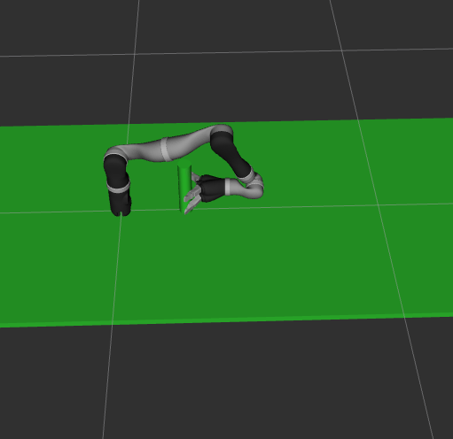
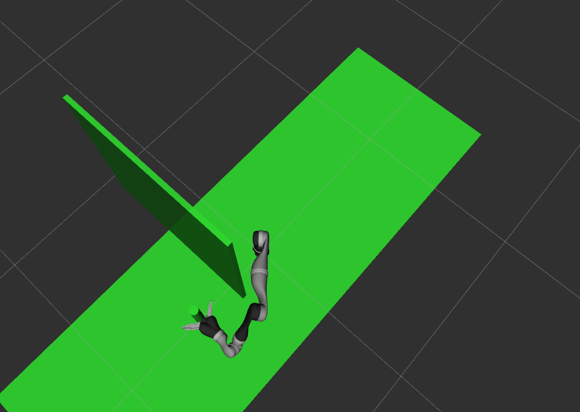
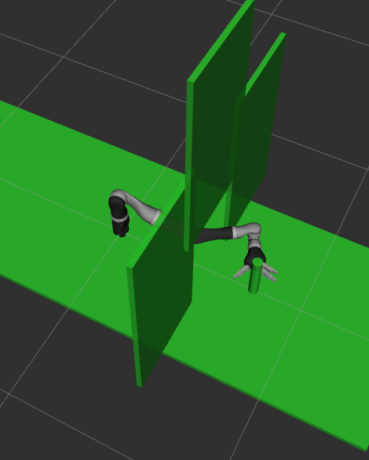

# rob534_final_project
final project for rob534

3 enviroments

## Simple world 
* Arm can reach all sides of object.

        rosrun kinova_scripts kinova_path_planning.py 0
  
<image>

</image>

## Moderate World
* Go around or over the top.
 

        rosrun kinova_scripts kinova_path_planning.py 1
        
<image>

</image>

## Hard World
* Go around through opening.
 

        rosrun kinova_scripts kinova_path_planning.py 2
        
<image>

</image>
